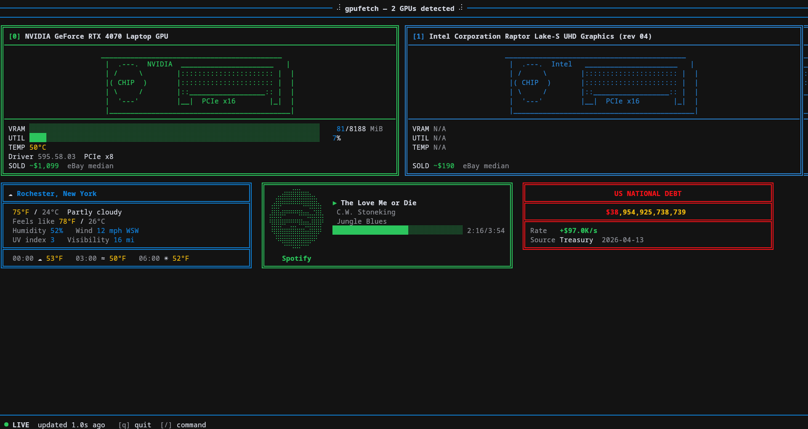

<h1 align="center">gpufetch</h1>
<p align="center"><i>A GPU monitor for your terminal</i></p>

---



---

## Installing

uv:
```
uv tool install gpufetch
```
pipx:
```
pipx install gpufetch
```

## Usage
```
usage: gpufetch [-h] [--theme NAME] [--entities a,b,c] [--entities-random N]
                [--fire] [--connect-spotify] [--spotify] [--sysinfo]
                [--weather] [--debt] [--tickers] [--play GAME]

options:
  -h, --help           show this help message and exit
  --theme NAME         display theme (default: default)
  --entities a,b,c     comma-separated entity names to bounce on screen
  --entities-random N  spawn N randomly chosen entities
  --fire               enable fire animation along the bottom
  --connect-spotify    run Spotify OAuth flow and save credentials, then exit
  --spotify            show Spotify now-playing widget
  --sysinfo            show CPU/memory usage widget
  --weather            show weather widget
  --debt               show US national debt clock widget
  --tickers            show market price ticker widget (BTC, XMR, S&P 500, NVDA)
  --play GAME          jump straight into a game: wordle, snake, roulette, blackjack

TUI keys: / → command prompt   q → quit   /help → command list
```
---

## Features

**GPU cards**
- Live VRAM usage bar, utilisation %, temperature, driver version, PCIe width
- eBay sold-listing median price fetched in the background for each detected GPU
- NVIDIA and AMD vendor colours; ASCII art PCB art inside each card

**Widgets** (toggle with `--flag` or `/command` at runtime)
| Flag | Command | What it shows |
|---|---|---|
| `--sysinfo` | `/sysinfo` | CPU usage bar, RAM and swap bars |
| `--weather` | `/weather` | Temperature, conditions, wind, hourly forecast (wttr.in) |
| `--spotify` | `/spotify` | Now-playing track, artist, progress bar |
| `--debt` | `/debt` | US national debt counter ticking in real time |
| `--tickers` | `/tickers` | BTC/USD, XMR/USD, S&P 500, NVDA with 24 h change % |

Multiple widgets tile side-by-side automatically when the terminal is wide enough.

**Entities** — ASCII art characters that bounce around the screen
`anime_girl` `arch` `bible_quote` `bill_100` `crab` `debian` `dvd` `empty_wallet` `ethereum` `fedora` `ghost` `gorilla` `greeting` `grim_reaper` `jesus` `jewish_star` `marge` `maui` `nuke` `nvidia` `rxknephew` `scrooge` `shadow_wizard` `ship` `slot_machine` `stuffed_wallet` `trophy` `tux` `ufo`

**Themes** — recolour the entire UI
`default` `america` `canada` `china` `christmas` `420` `halloween` `israel` `matrix` `rainbow`

**Games** (launch with `--play <name>` or `/play <name>`)
- `wordle`
- `snake`
- `roulette`
- `blackjack`

**Other**
- `/fire` - fire animation along the bottom
- `/8ball <question>` - Magic 8-ball overlay
- `/keybind <key> <command>` - bind any command to a single key
- `/change-theme <name>` / `/change-theme-random`

---

## Hacking / dev setup

**Prerequisites:** Python 3.11+, [uv](https://docs.astral.sh/uv/)

```bash
git clone https://github.com/kevinroleke/gpufetch
cd gpufetch

# Run directly from source (no install step needed)
uv run -m gpufetch

# Or install into an isolated tool env and iterate quickly
uv tool install . --editable
gpufetch
```

### Project layout

```
src/gpufetch/
├── main.py           # TUI loop, rendering, command dispatcher
├── ansi.py           # ANSI escape constants and strip_ansi()
├── sysinfo.py        # /proc poller + sysinfo widget
├── weather.py        # wttr.in poller + weather widget
├── debt.py           # Treasury API poller + debt clock widget
├── tickers.py        # CoinGecko/Stooq poller + ticker widget
├── prices.py         # eBay sold-listing price poller
├── spotify.py        # Spotify OAuth + now-playing poller
├── eightball.py      # Magic 8-ball responses and overlay
├── game_*.py         # Individual games (wordle, snake, roulette, blackjack)
├── entities/         # Bouncing ASCII art entities
│   ├── base.py       # EntitySpec dataclass — read this before adding one
│   └── *.py          # One file per entity, each exports SPEC = EntitySpec(...)
└── themes/
    ├── base.py       # Theme base class — read this before adding one
    └── *.py          # One file per theme, each exports THEME = MyTheme()
```

### Adding an entity

1. Create `src/gpufetch/entities/myname.py`
2. Define your ASCII art as a list of frame lists (one frame = list of strings)
3. Export `SPEC = EntitySpec(name="myname", frames=[frame1, frame2, ...], color=CYAN)`
4. It is auto-discovered — no registration needed

```python
from ..ansi import CYAN
from .base import EntitySpec

_F1 = ["( o_o)", "( > >)"]
_F2 = ["( o_o)", "(< <  )"]

SPEC = EntitySpec(name="myname", frames=[_F1, _F2], color=CYAN)
```

### Adding a theme

1. Create `src/gpufetch/themes/mytheme.py`
2. Subclass `Theme`, set `name`, override `apply(text, frame) -> str`
3. Export `THEME = MyTheme()`
4. Auto-discovered — no registration needed

```python
from .base import Theme, _rgb, _theme_walk

class MyTheme(Theme):
    name = "mytheme"

    def apply(self, text: str, frame: int) -> str:
        return _theme_walk(text, lambda col, row: _rgb(255, 128, 0))

THEME = MyTheme()
```

### Adding a widget

1. Create `src/gpufetch/mywidget.py` with a `MyPoller` class and a `render_my_widget(data, term_cols)` function
2. Follow the `DebtPoller` / `render_debt_widget` pattern in `debt.py`
3. Wire it into `main.py`:
   - Import at the top
   - Add parameter to `_render_widgets`, `execute_command`, and `run_tui`
   - Add the toggle command, tab completion entry, and `--myflag` CLI argument

### Rebuilding after changes

```bash
uv build --no-cache
uv tool install dist/gpufetch-*.whl --force
```
